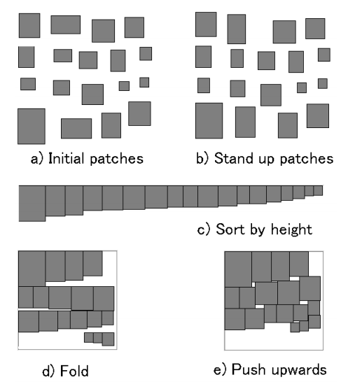

### Hello 👋

I'm Eric, I write documentation and code. My favorite languages are C and [Odin](https://odin-lang.org/).

Some docs, tutorials, and style guides I like:

- [Floating Point Visually Explained](https://fabiensanglard.net/floating_point_visually_explained/index.html)
- [Butterick's Practical Typography](https://practicaltypography.com/)
- [How to Center a Div](https://lawrencehook.com/blog/how-to-center-a-div/)
- [WebGL Fundamentals](https://webglfundamentals.org/)
- [Plaid](https://plaid.com/docs/)
- [Writing for GOV.UK](https://www.gov.uk/guidance/content-design/writing-for-gov-uk)
- [Mailchimp style guide](https://github.com/mailchimp/content-style-guide)
- [Raylib Cheatsheet](https://www.raylib.com/cheatsheet/cheatsheet.html)
- [Odin Language Overview](https://odin-lang.org/docs/overview/)
- [Zig Language Reference](https://ziglang.org/documentation/master/)

And a great visualization for a rectangle packing algorithm:

From [Adaptive Unwrapping for Interactive Texture Painting](https://www-ui.is.s.u-tokyo.ac.jp/~takeo/papers/i3dg2001.pdf).
